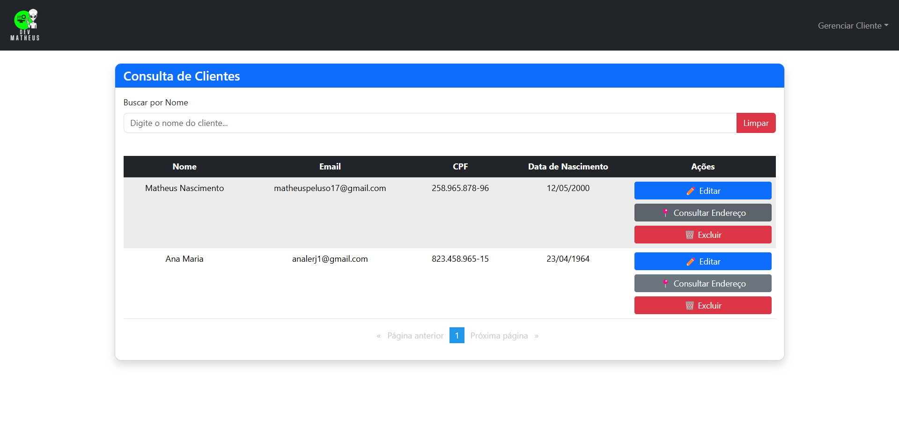
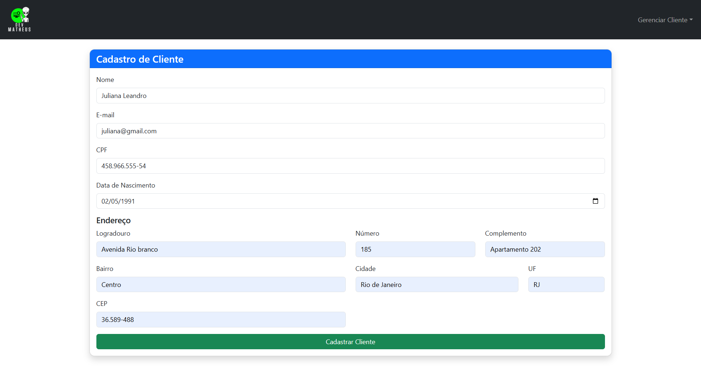
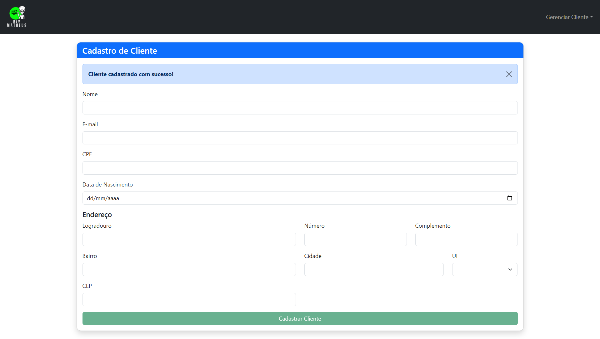
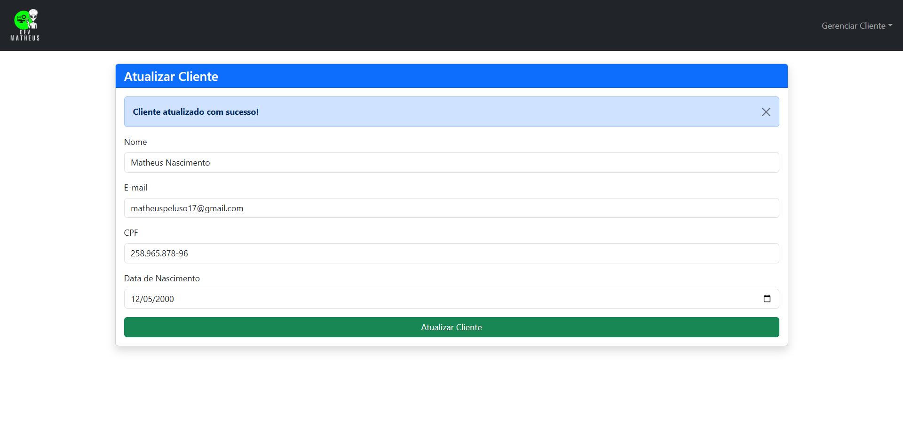
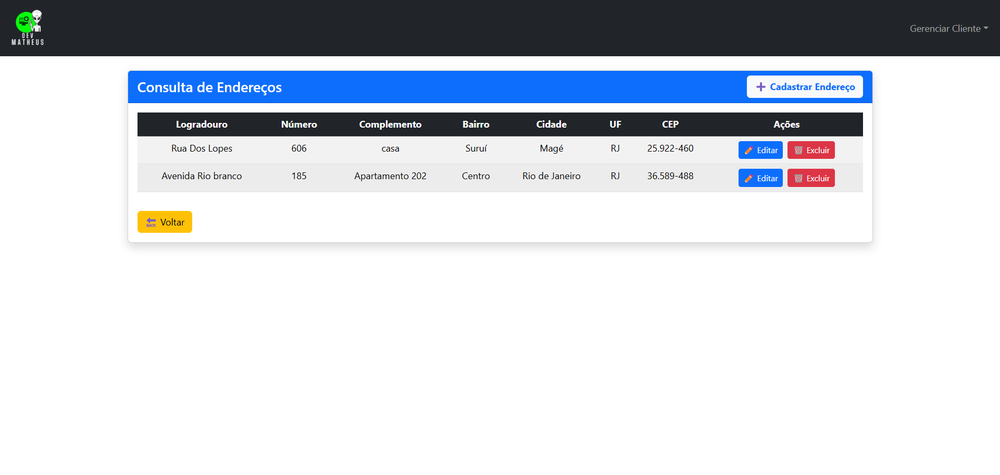
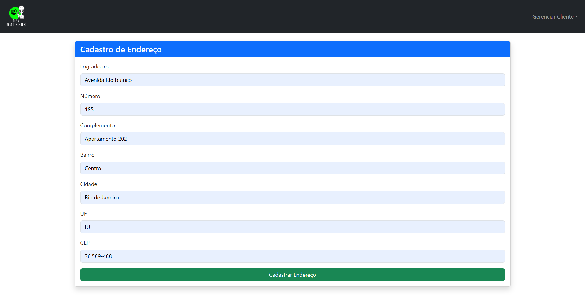
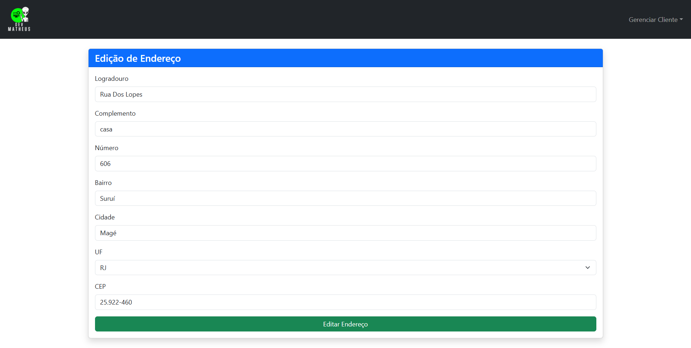

# FrontEnd Angular WebClientePf
Esse FrontEnd está integrado com a [ClietesAPI](https://github.com/matheuspeluso/ClientesApi_CRUD-de-cliente-e-enviando-dados-para-fila-de-rabbitmq)

Projeto gerado usando [Angular CLI](https://github.com/angular/angular-cli) na versão 19.1.7.

## Prints do projeto
 


  


  

## Requisitos para clonar e rodar o projeto
- Git
- [Node](https://nodejs.org/)
- AngularCLI

## Instalação do Angular CLI
Para instalar o AngularCLI é necessario já ter o Node instalado em sua maquina, e rodar o comando :
```bash
    npm install -g @angular/cli
```

## Clonando o projeto:
No terminal do Gitbash execute o seguinte comando : 
```bash
   git clone https://github.com/matheuspeluso/webClientePf.git
```
para acessar a pasta raiz do projeto:
```bash
   cd webClientesPf
```

## OBS
Antes de rodar o FrontEnd é preciso já está com as duas Apis rodando [ClientesApi](https://github.com/matheuspeluso/ClientesApi_CRUD-de-cliente-e-enviando-dados-para-fila-de-rabbitmq) e [ApiEmailMessage](https://github.com/matheuspeluso/apiEmailMessage-consumindo-fila-RabbitMQ-e-envio-de-email), siga o passo a passo no Github para clonar e rodar cada uma.

## Rodando o projeto 
Abra o gitbash ou o terminal CMD na pasta raiz do projeto e execute o seguinte comando:
```bash
   ng s -o
```
## Desenvolvido por 
- [Dev Matheus Peluso](https://github.com/matheuspeluso)

## Redes sociais
- [Linkedin](https://www.linkedin.com/in/devmatheuspeluso/)
- [Whatsapp](https://wa.me/5521993857520?text=Ol%C3%A1%20Matheus%20vim%20pelo%20seu%20GitHub!%20)